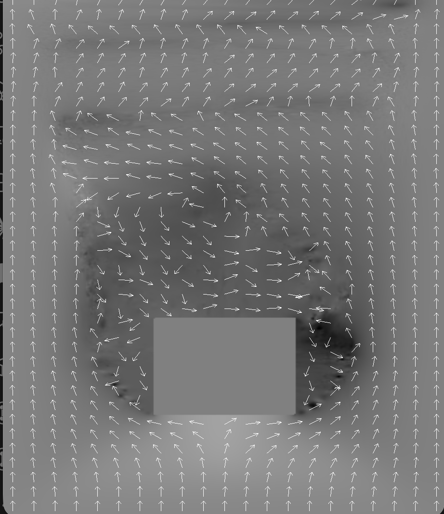
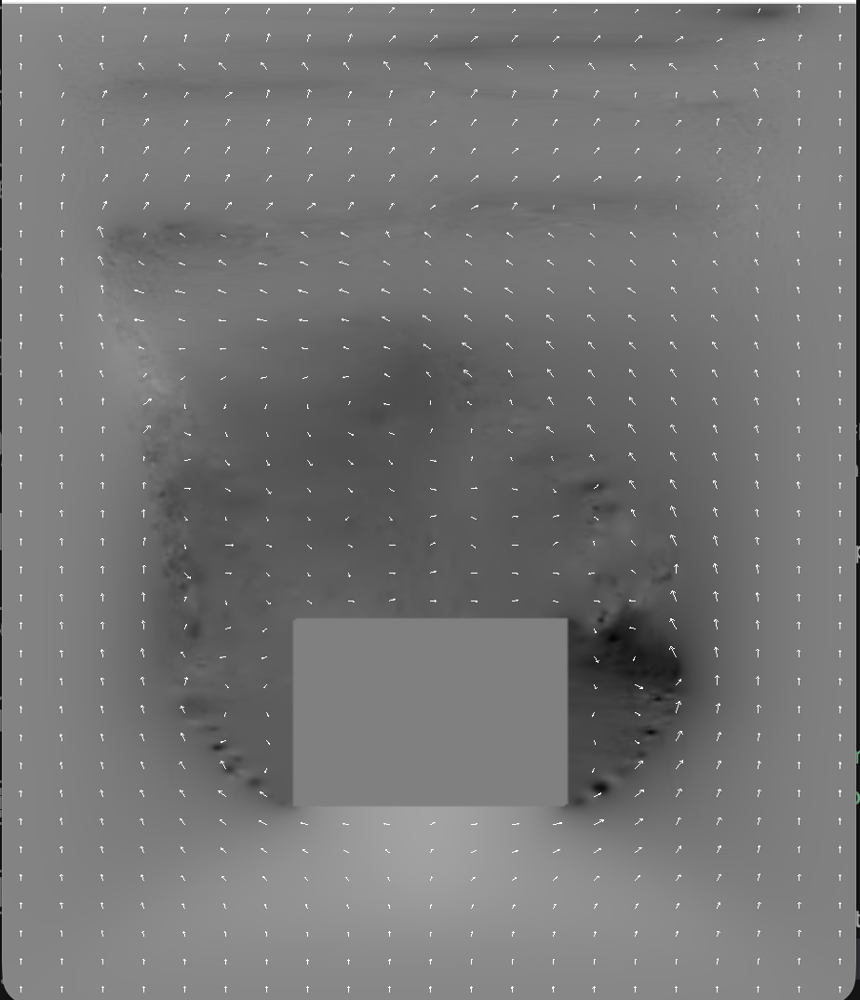
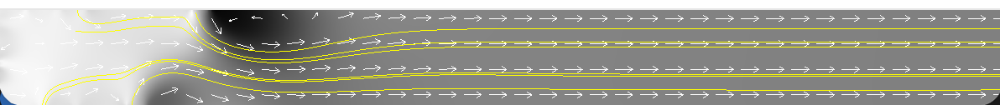
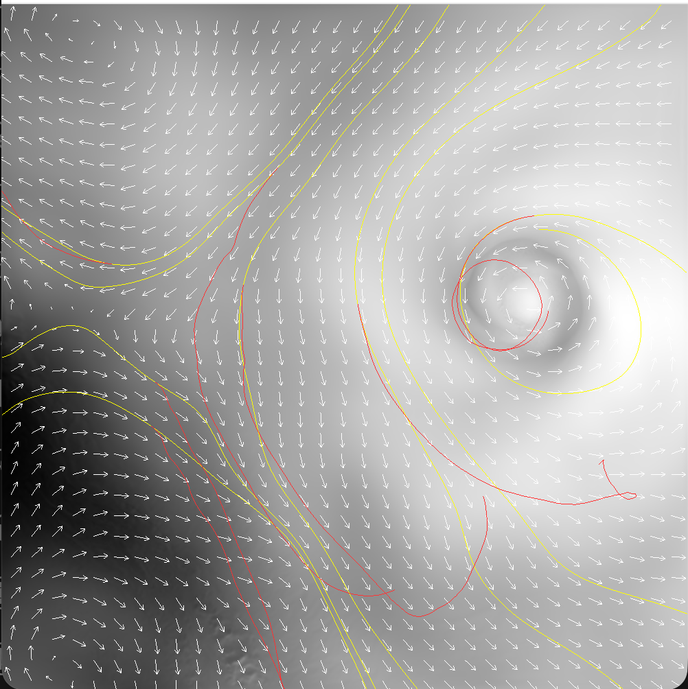
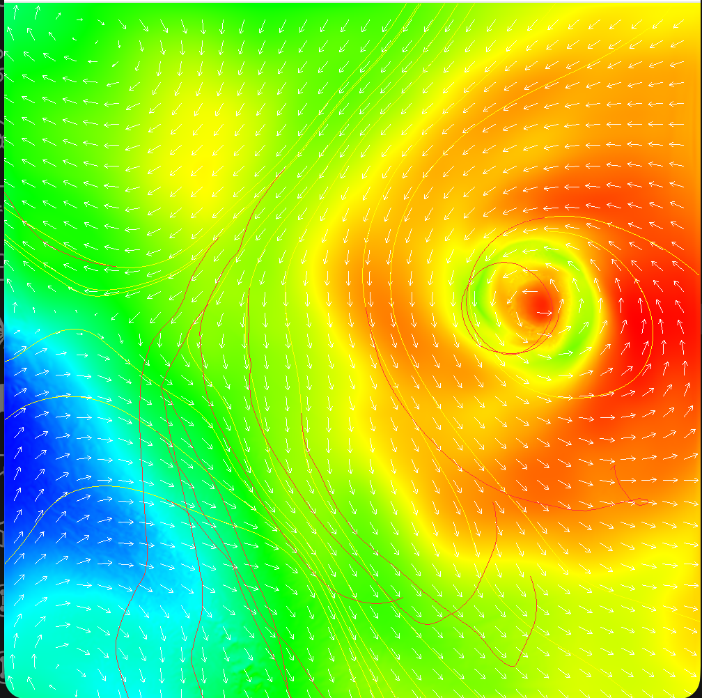
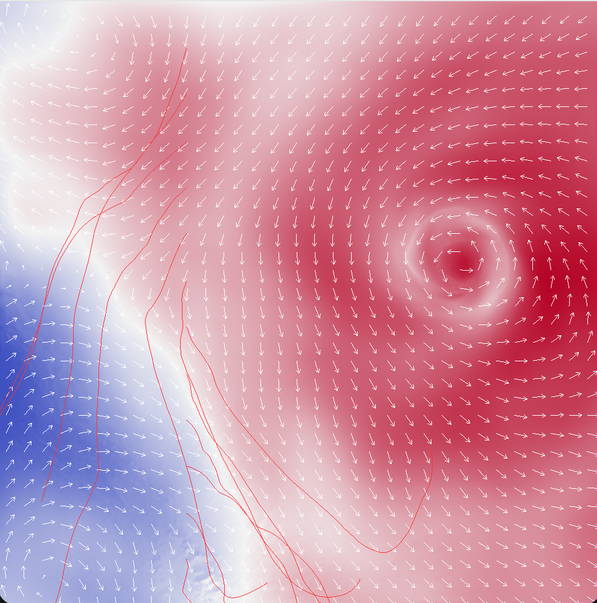

# CS 247 - Assignment 5: Vector Field Visualization

**Author:** Ayazhan Kadessova | **Date:** May 2026

## 1. Overview

2D vector field visualization with arrow glyphs, streamlines, pathlines, and a color-mapped scalar background. Datasets are block (steady), tube (19 timesteps), and hurricane (48 timesteps). C++ side handles data load, integration, and VBO uploads; the fragment shader does colormaps and an overlay branch so the same program draws background and lines. All bonuses implemented (rake, scalar-field switch, RK4 for both streamlines and pathlines).

## 2. Explanations

### 2.1 Glyphs

`drawGlyphs()` iterates the grid with stride `sampling_rate` and emits one arrow per visited cell — shaft + two head segments built in `buildArrow()`. Length is either constant (`base_len = 0.7 * stride`, grid units) or speed-scaled: `len = base_len * clamp(|v|*0.3, 0.2, 1.0)`. Keys `+` / `-` change density, `l` toggles the length mode. Glyphs are rebuilt every frame, so changes are live.

### 2.2 Bilinear / Trilinear Interpolation

`sampleVectorBilinear(x, y, t)` does the standard 4-corner weighted sum at fractional grid coords. `sampleVectorTrilinear(x, y, ft)` bilinearly samples at the two bounding timesteps and linearly blends with `a = ft - t0`. Out-of-grid neighbours return `vec2(0)`, so the integrator stops cleanly at boundaries.

### 2.3 Streamlines

`streamStep()` implements Euler, RK2 (Heun), and RK4 against a fixed time slice. `integrateStream()` runs the loop with these stopping conditions: `|v| < 1e-5` (critical point), next position outside `[0,W-1]×[0,H-1]` (boundary), accumulated arc length > 400 grid units, or 2000 step safety cap. Forward and backward are two calls with `dir = ±1`, so `h = dt * dir`. Seeds are pushed into `streamline_seeds`; the segment buffer `streamline_vertices` is appended to, never cleared on new seeds — only on dataset switch or `x` key.

When the timestep changes (`0` key), `recomputeAllStreamlines()` clears the vertex buffer, walks every saved seed, and re-integrates against the new slice — seeds persist, geometry updates.

### 2.4 Pathlines

Same shape as streamlines but the field is time-varying. `pathStep()` advances `t` alongside `p`: RK2's second sample is at `t + h`, RK4's mid-stages at `t + h/2`. `integratePath()` adds a temporal stopping condition: `nt` must stay in `[0, num_timesteps-1]`. Backward is `dir = -1` so we step the particle and also go back in time.

### 2.5 Colormaps + Blend Factor

In the fragment shader. Rainbow is 4 piecewise-linear segments (blue → cyan → green → yellow → red) using `mix()` at thresholds 0.25 / 0.5 / 0.75. Cool-warm is 2 segments at 0.5 (cool blue → near-white → warm red). Final pixel: `mix(gray, mapped, blendFactor)` so the user can slide between grayscale and color with `[` / `]`. The shader has an `if (colormapMode < 0)` early-out for overlays so the same program renders both background and lines without a second shader pipeline.

### 2.6 Adjustable dt

Global `dt`, modified by `i` / `k`, clamped `[0.0001, 1.0]`. Every integrator step multiplies the vector by `dt`. Smaller = more accurate, slower-growing line; larger = visible truncation drift.

### 2.7 Bonuses

- **Rake (+5):** Key `r` cycles off → vertical → horizontal. `seedRakeAt()` drops 12 seeds along the perpendicular axis spanning the full grid extent; each one runs the normal forward+backward integration.
- **Scalar-field switch (+3):** Key `s` cycles `current_scalar_field` and re-uploads the texture from the right offset in `scalar_fields[]`. On hurricane this swaps temperature ↔ cloud water.
- **RK4 streamlines (+5) / pathlines (+5):** Classical 4-stage Butcher tableau in `streamStep` and `pathStep`. Pathline RK4 advances time at each substage (`t + h/2`, `t + h/2`, `t + h`), which is what makes it actually 4th-order on unsteady fields.

## 3. Controls

| Key | Action |
|-----|--------|
| 1 / 2 / 3 | Load block / tube / hurricane |
| 0 | Cycle timestep (re-integrates streamlines) |
| a | Toggle arrows |
| l | Arrow length: constant ↔ speed-scaled |
| + / - | Sampling rate ± |
| t | Toggle streamlines; left-click to seed |
| p | Toggle pathlines; left-click to seed |
| m | Integration: Euler → RK2 → RK4 |
| x | Clear all seeds |
| r | Rake mode: off → vertical → horizontal |
| s | Cycle background scalar field |
| c | Colormap: off → rainbow → cool-warm |
| [ / ] | Blend factor ± |
| i / k | dt ± |
| b | Cycle clear color |
| q / Esc | Quit |

## 4. Problems

1. **Y-axis flipped for mouse seeding:** GLFW reports cursor with y-down (screen); grid is y-up. Flipped with `gy = (1 - ypos/H) * (vol_dim[1] - 1)` in the mouse callback.
2. **Overlays got tinted by the scalar texture:** First attempt drew streamlines with the same shader but they came out colored by what was underneath. Added a `colormapMode = -1` branch in the fragment shader that returns `vertexColor` directly without sampling the texture, and the C++ side sets it before each overlay draw.
3. **Streamlines disappeared on timestep change:** Initially I was just clearing the vertex buffer on `0`. Fixed by keeping `streamline_seeds` as a separate persistent list and re-integrating from each saved seed in `recomputeAllStreamlines()`.

## 5. Build & Run

```bash
cd /Users/kadessa/Documents/GitHub/assignment-5-ayazhankadessova
cmake -S . -B build
cmake --build build
./build/assignment_5B
```

## 6. Screenshots



*Block dataset — constant-length arrow glyphs over the pressure field. Flow pattern around the obstacle is clearly visible.*



*Same block scene with speed-scaled arrows (key `l`). Low-flow regions now have tiny arrows; the recirculation zone around the obstacle stands out.*



*Tube dataset — yellow streamlines (forward + backward integration from each seed) over the scalar background, with overlaid arrow glyphs.*



*Hurricane dataset — yellow streamlines and red pathlines together, both spiralling into the storm's eye. Pathlines (red) bend through time-varying flow while streamlines (yellow) follow the instantaneous field.*



*Hurricane temperature field with the rainbow colormap (key `c`, blend factor 1.0). Storm eye visible as the warm red core surrounded by the cooler outer bands.*



*Same field with the cool-warm diverging colormap and streamlines on top. Diverging palette emphasises the hot/cold contrast around the eye.*